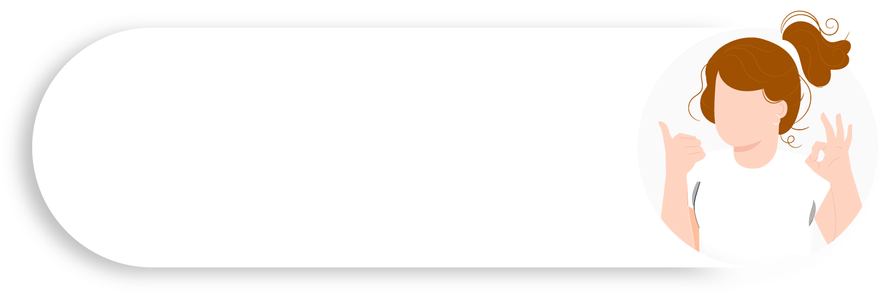

<!doctype html>
<html>
	<head>
		<title>MINE</title>
		<meta charset="utf-8">
		<link rel="stylesheet" href="mine-style.css">
		<link rel="stylesheet" href="Hover-master/Hover-master/css/hover.css">
		<link rel="stylesheet" href="https://stackpath.bootstrapcdn.com/font-awesome/4.7.0/css/font-awesome.min.css">
		<link rel="preconnect" href="https://fonts.gstatic.com">
<link href="https://fonts.googleapis.com/css2?family=Balsamiq+Sans&display=swap" rel="stylesheet">
		<link rel="preconnect" href="https://fonts.gstatic.com">
<link href="https://fonts.googleapis.com/css2?family=Warnes&display=swap" rel="stylesheet">
		<link rel="preconnect" href="https://fonts.gstatic.com">
<link href="https://fonts.googleapis.com/css2?family=Macondo+Swash+Caps&display=swap" rel="stylesheet">
	</head>
	<body>
<!--home-->
		<section id="home">
			

			
			

				<nav>
					<ul>
						<li><a href="#home"  class="hvr-wobble-top">HOME</a></li>
						<li><a href="#about"  class="hvr-wobble-top">ABOUT</a></li>
						<li><a href="#Service" class="hvr-wobble-top">SERVICES</a></li>
						<li><a href="#Skills" class="hvr-wobble-top">SKILLS</a></li>
					</ul>
				</nav>
			

			

				<h1 href="#" class="hvr-bounce-in">Hello Guys</h1>
				  
				
...Welcome To My Websites...

				

					<a href="#footer" class="hvr-back-pulse">CONTACT ME</a>
				

			

			

			

			

			<button id="btn"><a href="#home">

</a></button>
		</section>
<!--about-->
		<section id="about">
			

			

				
			

			

				

				

					

					 
				

			

		</section>
<!--Service-->
		<section id="Service">
			

			

				
			

			

				

				

					
					
					
				

				

				

				

				

				

				

			

		</section>
<!--Skills-->
		<section id="Skills">
			

			

				
			

			

				

				

					 
				

				

					

					 
					

					
					

					
					

					
					

					
			 	

				

		</section>
<!--footer-->
		<section id="footer">
			

			

			

				

				

				

				

			

				

				<i class="fa fa-facebook"></i>
				<i class="fa fa-instagram"></i>
				<i class="fa fa-twitter"></i>
				<i class="fa fa-youtube-play"></i>
				
			

			

		</section>
	</body>
</html>
